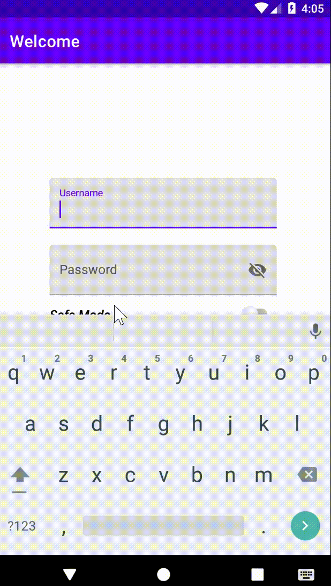
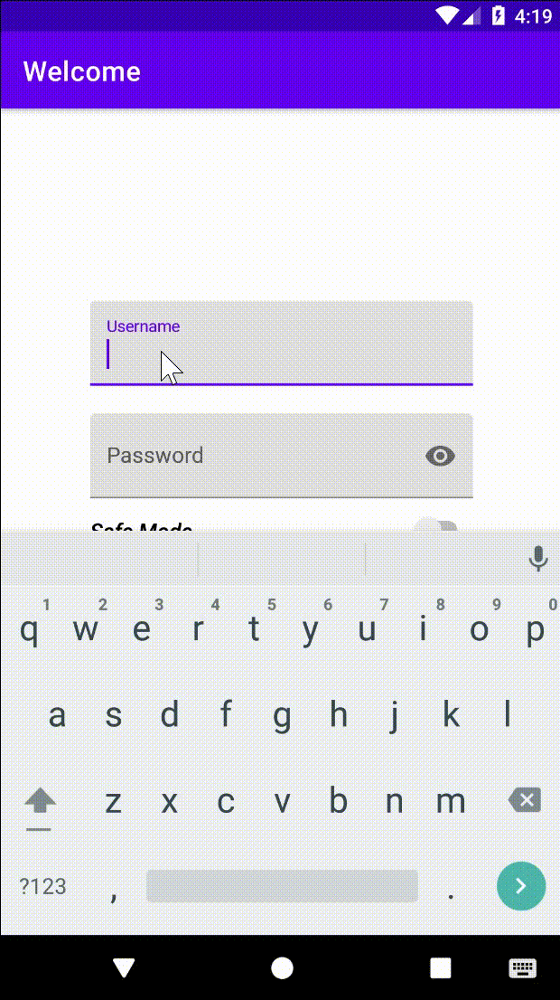

# SQL Injection Demo


It is an android application designed to show how a SQL-injection attack works on mobile platforms. I released both source code and [apk](https://github.com/li-xin-yi/SQL-inject-demo/releases/tag/v0.0.3) file only for some purposes of teaching in college. It can not be directly used in any productive environment. I adapt [SQL Injection Attack Lab](https://seedsecuritylabs.org/Labs_16.04/PDF/Web_SQL_Injection.pdf) from [SEED project](https://seedsecuritylabs.org/) and build a similar employee management system, instead of hosting a remote MySQL database server for a *web application*, I integrate the SQLite database inside the *mobile application*. Several common SQL-injection attack can be simply explored on this app. Besides, It also provides an interface to add/update/delete employee data for an Admin account, which may be helpful to customize the instance data in a more flexible way.

I have almost no knowledge about Android or Java before, neither about any UI design. So I am sorry that the code and app may look ugly and even buggy. **I will appreciate it if you give me any advice on improving it. **The project is built with Android API level 17, I have tested it on emulators of API 25 (Pixel 2) and API 30 (Pixel 3a). I don't know if it also works properly on other qualified android release version. (>=4.1)

More information:

- [APK Download](https://github.com/li-xin-yi/SQL-inject-demo/releases/download/v0.0.3/sql-inject-demo.apk)
- [Lab Manual](https://security-summer-labs.readthedocs.io/en/latest/lab8/readme.html)
- A survey about SQL injection attack: [Detection and prevention of sql injection attack: A survey](https://www.researchgate.net/profile/Zainab-Alwan-5/publication/320108029_Detection_and_Prevention_of_SQL_Injection_Attack_A_Survey/links/59ce63840f7e9b4fd7e1b495/Detection-and-Prevention-of-SQL-Injection-Attack-A-Survey.pdf)

## Database

The `employee` table in the initial database `Employee.db` on this app is:

ID | Name | Password |  SSN | Salary | Nickname | Phone | Email | Address | Birthday
---|---|---|---|---|---|---|---|---|---|
99999 | Admin | admin | 43254314 | 400000 | Admin | (403) 220-1191 | admin@hogwarts.edu | Gryffindor House | 1990-03-05
10000 | Alice | alice | 10211002 | 20000 | Alice | (400)210-2112 | alice@hogwarts.edu | Gryffindor House | 2000-09-20
20000 | Bobby | bobby | 10213352 | 50000 | Bob | (404) 789-2313 | boby@hogwarts.edu | Hufflepuff House | 2000-04-20
30000 | Ryan | ryan | 32193525 | 90000|  Ryanny | (210) 096-3287 | ryan@hogwarts.edu | Ravenclaw House | 2000-04-10
40000 | Sammy | sammy | 32111111 | 40000 | Sam | (450) 218-8876 | samy@hogwarts.edu | Slytherin House | 2000-01-11 
50000 | Ted | ted | 24343244 | 110000 | Teddy | (208) 222-8712 | ted@hogwarts.edu | Azkaban | 2000-11-03

Anytime you want to recover the data as above, press "RESET" button on the login screen.

## Demo

Detailed operations can be found on [this lab manual](https://security-summer-labs.readthedocs.io/en/latest/lab8/readme.html).

#### Login as admin with `--`




#### Login with `1=1` injection



#### Alice changes her salary by herself


#### Alice changes Boby's salary


## Countermeasure

SQL-injection vulnerability is caused by simply joining variables when creating SQL statement. For this app, the mitigation is to use *prepared statement* instead. You can try it by toggling the "Safe Mode" switch when login, the code snippet shows how to switch the app into a safe mode:

```java
if(!safe) {
    query = "SELECT * FROM " + TABLE_NAME + " WHERE NAME='" + username + "' AND PASSWORD='" + password + "'";
    cursor = db.rawQuery(query, null);
}
else
{
    query = "SELECT * FROM "+ TABLE_NAME + " WHERE NAME=? AND PASSWORD=?";
    cursor = db.rawQuery(query, new String[]{username,password});
}
```


 
